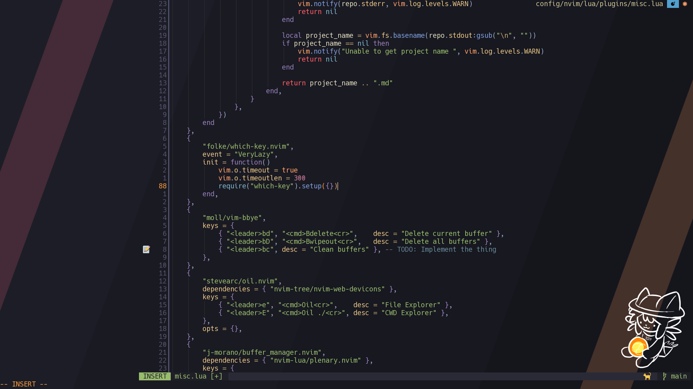

# Duck's dotfiles
## Screenshots

## Available configurations
- Fontconfig
- Kitty
- Neovide
- Neovim
- Nushell
- Starship
- Wezterm
- Zellij
- Zsh
## Installation
Dotfiles are managed by `stow` via `make`.

Apply dotfiles
```bash
make stow
```
Unapply dotfiles
```bash
make unstow
```
Reapply dotfiles
```bash
make restow
```
These commands are here mostly as a reminder, unless you want to use all of my dotfiles.
## License
I don't really care about licenses, you are free to copy/edit/share the dotfiles.
Some artwork included in the repository is not owned by me, look for `README.txt` files which contain ownership information.
